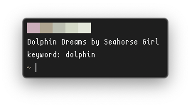
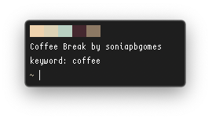

# colorlovers

  

apply palettes from colorlovers as system colors (requires `wal`, `jq`)

## Usage
```
usage: colorlovers [OPTION] [SEARCHTERM]
      [-n] [-s] [-r] [-l] [-h] [-q]
       
example: colorlovers spring
         colorlovers -l coffee
		 colorlovers -nr
	 
optional arguments:
  -n                      notify when done (requires notify-send)
  -s                      save colorscheme to ~/.cache/wal/colorschemes/dark
  -r                      load random theme from ~/.cache/wal/colorschemes/dark
  -q                      quiet mode (print nothing)
  -h                      display this help page and exit
  ```
