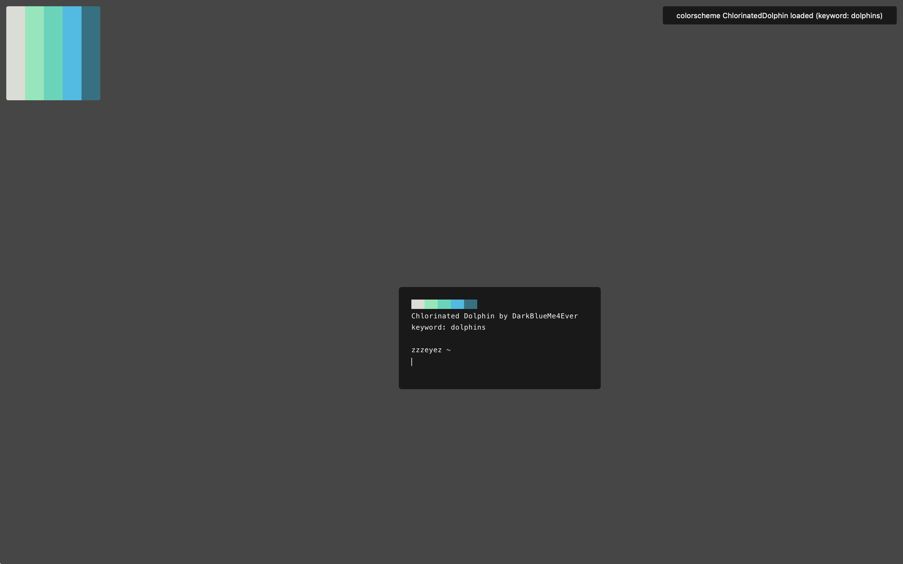

# colorlovers



apply palettes from colorlovers as system colors (requires `wal`, `jq`)

[](https://www.paypal.me/zzzeyez/)

## Usage
```
usage: colorlovers [OPTION] [SEARCHTERM]
      [-n] [-s] [-r] [-l] [-q] [-t] [-o theme] [-c] [-h]
       
example: colorlovers spring
         colorlovers -l coffee
         colorlovers -nqr
	 
optional arguments:
  -n                      notify when done (requires notify-send)
  -s                      save colorscheme to ~/.cache/colorlovers
  -r                      load random theme from ~/.cache/colorlovers
  -b [hex color]          custom background color (foreground
                          color chosen appropriately)
  -l                      light mode
  -q                      quiet mode (print nothing)
  -t                      list all themes
  -o [theme]              load theme
  -c                      clear cache (~/.cache/colorlovers)
  -h                      display this help page and exit
```

## Features
`colorlovers` stores the search terms and background colors you choose so that it can select from them randomly when no arguments are provided.  These lists are located at ~/.cache/colorlovers/keywords and ~/.cache/colorlovers/bg in case you want to manually edit them yourself.

All cache data can be erased by running `colorlovers -c`.
